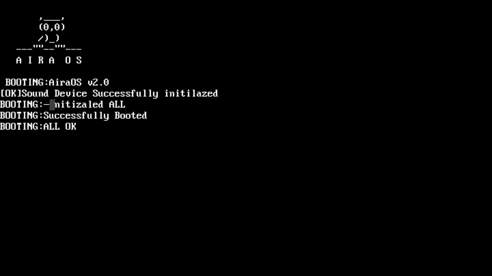
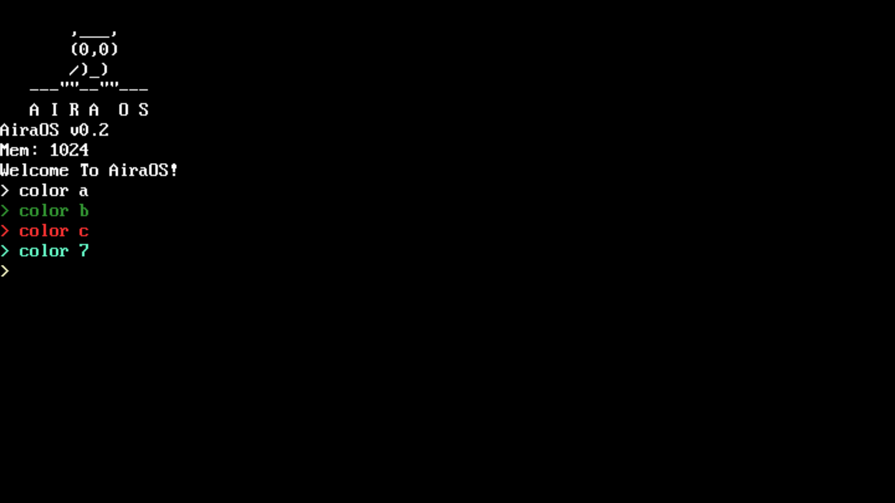

# AiraOS
This is my first attempt at creating an operating system. It is a minimal OS project and is not intended for actual use.


## Features

Minimal kernel with a terminal prompt (>)

Simple nano-like editor

Has a mini language (.aira)

Sound Device, Sound Blaster 16 and PC Speaker

Screen color changes

VESA Graphics 1024x768

**Notes**

This is just a hobby project / OS experiment.

## Images





## Build
UEFI-compatible GRUB is needed to boot the ISO:
**Note**:If you are using Windows, install WSL to build.
**Type in the terminal**:
```
sudo apt update
```

```bash
sudo apt install grub-efi-amd64-bin grub-common
```

```bash
sudo apt install qemu qemu-system-x86
```

```bash
make
```

```bash
make run

```

## Commands
```acmd
nano
```
Opens nano editor

```acmd
compile filename.aira
``` 
It interprets the code written in the nano editor.

```acmd
clear
```
Clears all screen
```acmd
color a
```
Sets VGA text mode current color to 0x0A (green)
```acmd
color b
```
Sets VGA text mode current color to 0x0B (blue)

```acmd
color c
```
Sets VGA text mode current color to 0x0C (red)

```acmd
color 7
```
Sets VGA text mode current color to 0x07 (gray)
```acmd
beep
```
440hz beep sound
```acmd
reboot
```
Reboots pc
```acmd
testpanic
```
Test panic screen
## Aira Proggraming Language Tutorial
```
print("hello world")
```
prints string or variable
```
set varstr = "hello"
set varint = 10
```
variable definition
```
loop 10
  print("hello world")
endloop
```
loops
```
beep(440)
beep(440,10)
```
beeps freq or freq and duration
```
color a
color b
color c
color 7
```
changes color a/b/c/7
```
sleep(50)
```
cpu sleeps miliseconds
```
add 1,1
sub 1,1
mul 1,1
div 10,0
```
mathematichs

## Example
```
set freq = 10
color a
loop 100
  beep(freq,50)
  add freq,10
  print("freq is:")
  print(freq)
  sleep(30)
endloop
```

## If you like the project, give it a ⭐!

#### The project is mainly for learning and experimentation.
